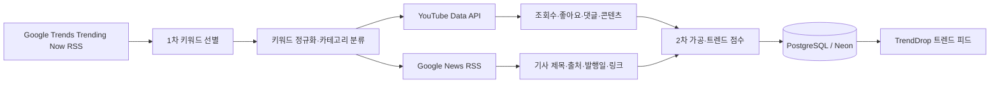
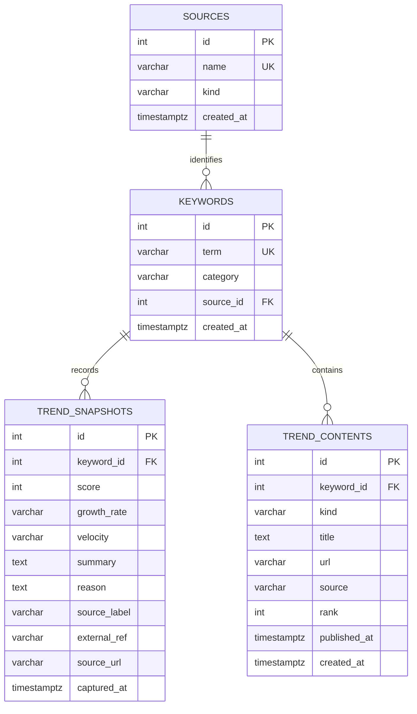

# TrendDrop 데이터 파이프라인

## 수집·가공 흐름

```mermaid
flowchart LR
  A[Google Trends Trending Now RSS] --> B[1차 키워드 선별]
  B --> C[키워드 정규화·카테고리 분류]
  C --> D[YouTube Data API]
  C --> E[Google News RSS]
  D --> F[조회수·좋아요·댓글·콘텐츠]
  E --> G[기사 제목·출처·발행일·링크]
  F --> H[2차 가공·트렌드 점수]
  G --> H
  H --> I[(PostgreSQL / Neon)]
  I --> J[TrendDrop 트렌드 피드]
```

수집 엔드포인트는 `POST /api/admin/collect/pipeline`이며, 기본 국가는 `KR`입니다.
`YOUTUBE_API_KEY`가 없으면 YouTube 단계는 건너뛰고 Google Trends와 Google News 결과만 저장합니다.

## ERD

```mermaid
erDiagram
  SOURCES ||--o{ KEYWORDS : identifies
  KEYWORDS ||--o{ TREND_SNAPSHOTS : records
  KEYWORDS ||--o{ TREND_CONTENTS : contains

  SOURCES {
    int id PK
    varchar name UK
    varchar kind
    timestamptz created_at
  }
  KEYWORDS {
    int id PK
    varchar term UK
    varchar category
    int source_id FK
    timestamptz created_at
  }
  TREND_SNAPSHOTS {
    int id PK
    int keyword_id FK
    int score
    varchar growth_rate
    varchar velocity
    text summary
    text reason
    varchar source_label
    varchar external_ref
    varchar source_url
    timestamptz captured_at
  }
  TREND_CONTENTS {
    int id PK
    int keyword_id FK
    varchar kind
    text title
    varchar url
    varchar source
    int rank
    timestamptz published_at
    timestamptz created_at
  }
```
